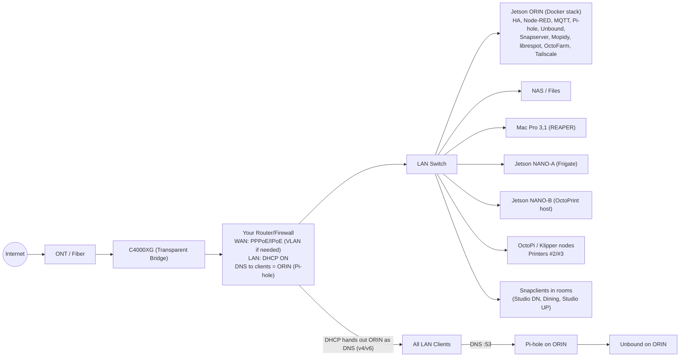
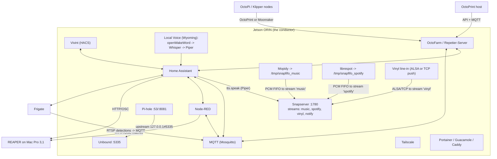
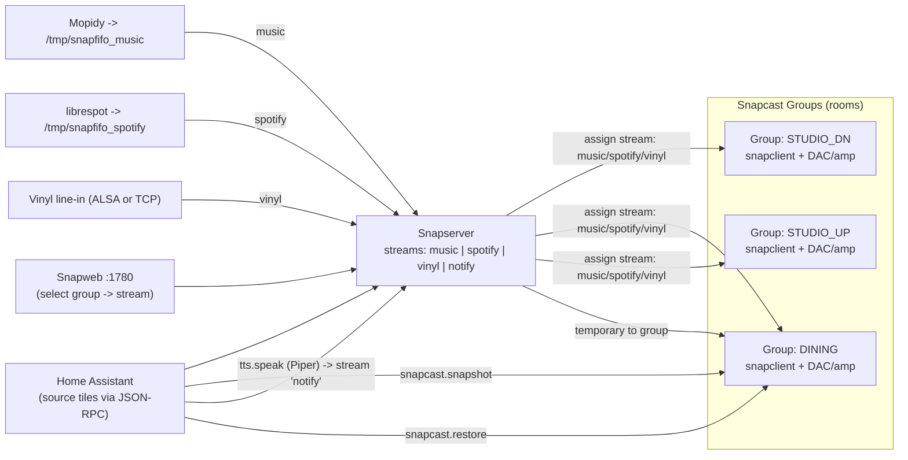

# Jetson-Orchestrated Home & Studio — Option C System Map

*A living map of the network, audio fabric, automations, and edges.*  
**Paste this whole file into your repo/wiki/Obsidian.** Mermaid diagrams are in fenced code blocks like ` ```mermaid `.

> **Tip:** If your viewer doesn’t render Mermaid, install a Mermaid plugin (e.g., VS Code “Markdown Preview Mermaid Support”) or use https://mermaid.live to preview each block.

---

## Quick legend

- **ORIN** = Jetson Orin Nano (“the conductor”) near router/NAS.  
- **NANO‑A** = Frigate/vision edge.  
- **NANO‑B** = Print edge (OctoPrint host for at least one printer).  
- **Rooms** = Snapcast clients (Studio downstairs, Dining, Studio upstairs).  
- **Your Router/Firewall** = your own downstream router; C4000XG is in Transparent Bridge.

You’ll customize IPs, names, and ports below.

---

## Variables (fill these once)

| Name | Example | Meaning |
|---|---|---|
| `ORIN_HOSTNAME` | `orin-core` | Linux hostname for the Orin |
| `ORIN_IP` | `192.168.50.50` | Static LAN IP for Orin |
| `ROUTER_LAN` | `192.168.50.0/24` | LAN subnet |
| `ROUTER_DNS_V4` | `192.168.50.50` | DNS handed to clients (Pi-hole on Orin) |
| `ROUTER_DNS_V6` | `fd00::50` | v6 DNS (optional) |
| `MOPIDY_FIFO` | `/tmp/snapfifo_music` | FIFO for Mopidy → Snapcast |
| `LIBRESPOT_FIFO` | `/tmp/snapfifo_spotify` | FIFO for librespot → Snapcast |
| `VINYL_ALSA_DEV` | `hw:1,0` | ALSA device for USB ADC |
| `SNAPWEB_PORT` | `1780` | Snapserver web UI port |
| `HA_URL` | `http://homeassistant.local:8123` | Home Assistant URL |

---

## 1) Network backbone (Option C)



---

## 2) ORIN core services & control paths



---

## 3) Multi-room audio (per-room sources + scoped TTS)



---

## 4) Minimal bring-up checklist

1. **Bridge the C4000XG**, set your **router** WAN (PPPoE/IPoE, VLAN if needed), enable DHCP.  
2. Reserve `ORIN_IP` on the router, and **hand out ORIN as DNS (v4/v6)**.  
3. On ORIN: deploy Docker stack (HA, Node-RED, Mosquitto, Pi-hole, Unbound, Snapserver, Mopidy, librespot, OctoFarm).  
4. On room boxes: install **snapclient** and join the Snapserver. Create three **groups** in Snapweb.  
5. In HA: add **Snapcast**, **Vivint (HACS)**, **Google Calendar(s)**; create “source select” tiles and TTS automations.  
6. For vinyl: attach USB ADC at `VINYL_ALSA_DEV` on ORIN **or** push from a small box via:\
   `ffmpeg -f alsa -i hw:1,0 -ac 2 -ar 48000 -f s16le tcp://ORIN_IP:1704`.

---

## 5) Room source selectors (HA stub)

```yaml
# input_selects per room (show as tiles)
input_select:
  src_studio_dn:
    name: Studio Downstairs Source
    options: [music, spotify, vinyl]
  src_dining:
    name: Dining Source
    options: [music, spotify, vinyl]
  src_studio_up:
    name: Studio Upstairs Source
    options: [music, spotify, vinyl]

# rest_command calling Snapcast JSON-RPC (adjust ORIN_IP)
rest_command:
  snap_set_stream:
    url: "http://{{ ORIN_IP }}:1780/jsonrpc"
    method: post
    headers:
      Content-Type: application/json
    payload: >
      {"id":1,"jsonrpc":"2.0","method":"Group.SetStream","params":{"id":"{{ group_id }}","stream_id":"{{ stream_id }}"}}

# automations mapping selects -> group streams
automation:
  - alias: "Studio DN source select"
    trigger: { platform: state, entity_id: input_select.src_studio_dn }
    action:
      - service: rest_command.snap_set_stream
        data:
          group_id: "G_STUDIO_DN"     # use your real group id from Snapweb JSON
          stream_id: "{{ states('input_select.src_studio_dn') }}"
```

---

## 6) Security hardening moves (keep DNS + remote access tight)

Lay these in right after basic bring-up so you never have to wonder who can whistle into your stack.

### Firewall choreography

| Rule | Interface | Action | Why |
|---|---|---|---|
| Allow `LAN -> ORIN` TCP/UDP `53`, TCP `5335`, TCP `1780`, TCP `8123`, TCP `9001-9003` (Snap/MQTT/HA) | LAN | Accept | LAN clients need DNS + control-path ports |
| Allow `TAILNET -> ORIN` TCP `22`, TCP `8123`, TCP `9001-9003`, TCP `8081`, TCP `1780` | Tailscale interface | Accept | Tailnet-only remote admin + HA |
| Block `WAN -> ORIN` any | WAN | Drop | No exposed services to the raw internet |
| Block `LAN -> ORIN` TCP `22` except management IPs | LAN | Drop | Only your jump boxes SSH in |
| Block `LAN/WAN -> ORIN` TCP/UDP `53` unless source = LAN/Tailnet CIDR | LAN/WAN | Drop | Keeps Pi-hole DNS scoped |

*(Translate to your firewall syntax: e.g., `set firewall name LAN-IN rule 10 action accept ...` on VyOS, or `ufw allow from 192.168.50.0/24 to any port 53 proto tcp` on Ubuntu.)*

### Tailscale ACL snippet

```json
{
  "acls": [
    { "action": "accept", "src": ["tag:admin", "group:ops"], "dst": ["orin-core:22", "orin-core:8123", "orin-core:1780", "orin-core:8081"] },
    { "action": "accept", "src": ["tag:display"], "dst": ["orin-core:8123"] },
    { "action": "accept", "src": ["tag:automation"], "dst": ["orin-core:1883"] }
  ],
  "dns": {
    "magicDNS": true,
    "nameservers": [ { "ip": "100.x.y.z" } ],
    "overrideLocalDNS": true,
    "searchDomains": ["homeauto.tail"]
  },
  "nodeAttrs": [
    { "target": ["tag:admin"], "attr": [{"key": "allow-ssh", "value": "true"}] }
  ]
}
```

- Tag every box that should reach Orin (`tailscale tag set admin orin-core`).
- Use tailnet DNS → Pi-hole so remote devices resolve your LAN hostnames without leaking queries.
- Reject everything else by default; only ship the ports you actually monitor.

### Pi-hole + Unbound best practices

- Bind Pi-hole to **LAN + Tailscale** interfaces only (`Settings → DNS → Interface listening behavior → Listen on all interfaces, permit only listed clients`).
- Lock Unbound to localhost (`interface: 127.0.0.1` and optionally the Tailscale IP if you run split DNS).
- Enable **DNSSEC** and **QNAME minimisation** inside `unbound.conf` to shred metadata.
- Populate Pi-hole’s **Conditional Forwarding** with your router’s subnet only if you absolutely need reverse lookups; otherwise, keep queries local.
- Create an allow-list of client subnets (LAN + tailnet) and drop everything else (`pihole -a -iL "192.168.50.0/24,100.64.0.0/10"`).
- Monitor Pi-hole audit logs and port hits via your firewall—unexpected chatter means something’s phoning home.

## 7) Notes

- Keep **Pi-hole** bound to LAN/tailnet only; upstream is **Unbound** at `127.0.0.1#5335`.  
- Use **Tailscale** for private remote access to HA, OctoFarm, Snapweb, Pi-hole; set tailnet DNS → ORIN.  
- For REAPER, enable **Web Remote** + **OSC** on the Mac; Node-RED/HA call your custom actions.  
- Vivint via **HACS** provides entities and RTSP modes; scope TTS to rooms with **snapcast.snapshot/restore**.  
- Start simple: get one stream + one room working, then add the rest.

---

_Last updated: 2025‑09‑04_
