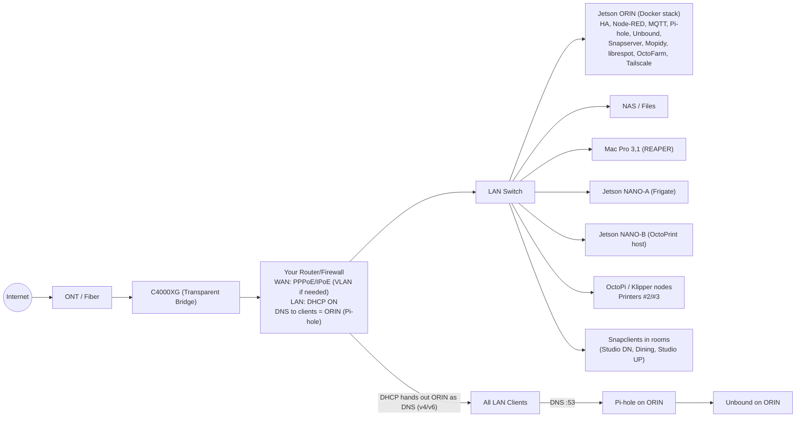
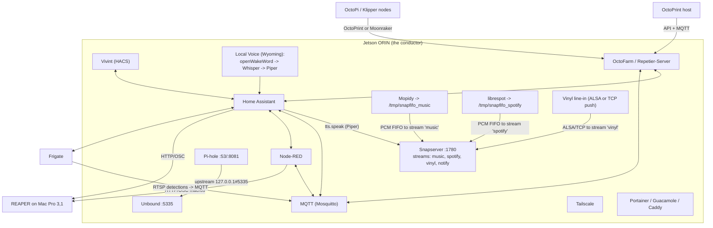
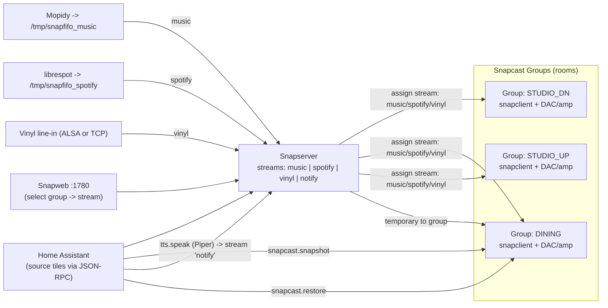

# Jetson-Orchestrated Home & Studio — Option C System Map

*A living map of the network, audio fabric, automations, and edges.*  
**Paste this whole file into your repo/wiki/Obsidian.** Mermaid diagrams are in fenced code blocks like ` ```mermaid `.

> **Tip:** If your viewer doesn’t render Mermaid, install a Mermaid plugin (e.g., VS Code “Markdown Preview Mermaid Support”) or use https://mermaid.live to preview each block.

---

## Quick legend

- **ORIN** = Jetson Orin Nano (“the conductor”) near router/NAS.  
- **NANO‑A** = Frigate/vision edge.  
- **NANO‑B** = Print edge (OctoPrint host for at least one printer).  
- **Rooms** = Snapcast clients (Studio downstairs, Dining, Studio upstairs).  
- **Your Router/Firewall** = your own downstream router; C4000XG is in Transparent Bridge.

You’ll customize IPs, names, and ports below.

---

## Variables (fill these once)

| Name | Example | Meaning |
|---|---|---|
| `ORIN_HOSTNAME` | `orin-core` | Linux hostname for the Orin |
| `ORIN_IP` | `192.168.50.50` | Static LAN IP for Orin |
| `ROUTER_LAN` | `192.168.50.0/24` | LAN subnet |
| `ROUTER_DNS_V4` | `192.168.50.50` | DNS handed to clients (Pi-hole on Orin) |
| `ROUTER_DNS_V6` | `fd00::50` | v6 DNS (optional) |
| `MOPIDY_FIFO` | `/tmp/snapfifo_music` | FIFO for Mopidy → Snapcast |
| `LIBRESPOT_FIFO` | `/tmp/snapfifo_spotify` | FIFO for librespot → Snapcast |
| `VINYL_ALSA_DEV` | `hw:1,0` | ALSA device for USB ADC |
| `SNAPWEB_PORT` | `1780` | Snapserver web UI port |
| `HA_URL` | `http://homeassistant.local:8123` | Home Assistant URL |

---

## 1) Network backbone (Option C)



---

## 2) ORIN core services & control paths



---

## 3) Multi-room audio (per-room sources + scoped TTS)



---

## 4) Minimal bring-up checklist

1. **Bridge the C4000XG**, set your **router** WAN (PPPoE/IPoE, VLAN if needed), enable DHCP.  
2. Reserve `ORIN_IP` on the router, and **hand out ORIN as DNS (v4/v6)**.  
3. On ORIN: deploy Docker stack (HA, Node-RED, Mosquitto, Pi-hole, Unbound, Snapserver, Mopidy, librespot, OctoFarm).  
4. On room boxes: install **snapclient** and join the Snapserver. Create three **groups** in Snapweb.  
5. In HA: add **Snapcast**, **Vivint (HACS)**, **Google Calendar(s)**; create “source select” tiles and TTS automations.  
6. For vinyl: attach USB ADC at `VINYL_ALSA_DEV` on ORIN **or** push from a small box via:\
   `ffmpeg -f alsa -i hw:1,0 -ac 2 -ar 48000 -f s16le tcp://ORIN_IP:1704`.

---

## 5) Room source selectors (HA stub)

```yaml
# input_selects per room (show as tiles)
input_select:
  src_studio_dn:
    name: Studio Downstairs Source
    options: [music, spotify, vinyl]
  src_dining:
    name: Dining Source
    options: [music, spotify, vinyl]
  src_studio_up:
    name: Studio Upstairs Source
    options: [music, spotify, vinyl]

# rest_command calling Snapcast JSON-RPC (adjust ORIN_IP)
rest_command:
  snap_set_stream:
    url: "http://{{ ORIN_IP }}:1780/jsonrpc"
    method: post
    headers:
      Content-Type: application/json
    payload: >
      {"id":1,"jsonrpc":"2.0","method":"Group.SetStream","params":{"id":"{{ group_id }}","stream_id":"{{ stream_id }}"}}

# automations mapping selects -> group streams
automation:
  - alias: "Studio DN source select"
    trigger: { platform: state, entity_id: input_select.src_studio_dn }
    action:
      - service: rest_command.snap_set_stream
        data:
          group_id: "G_STUDIO_DN"     # use your real group id from Snapweb JSON
          stream_id: "{{ states('input_select.src_studio_dn') }}"
```

---

## 6) Notes

- Keep **Pi-hole** bound to LAN/tailnet only; upstream is **Unbound** at `127.0.0.1#5335`.
- Use **Tailscale** for private remote access to HA, OctoFarm, Snapweb, Pi-hole; set tailnet DNS → ORIN.
- For REAPER, enable **Web Remote** + **OSC** on the Mac; Node-RED/HA call your custom actions.
- Vivint via **HACS** provides entities and RTSP modes; scope TTS to rooms with **snapcast.snapshot/restore**.
- Start simple: get one stream + one room working, then add the rest.

---

## 7) MQTT feedback loop recipes (copy-paste, then riff)

These are real-ish Node-RED exports and HA fragments that stitch the MQTT exhaust into loud, blinking, useful feedback. Drop them in, change the IDs, and you’ve got closed loops instead of vibes.

### 7.1) Alert router — turn detections into scoped sirens

**What it does:** Frigate (or any camera box) screams on `frigate/events`. Node-RED filters for human-sized chaos, pings MQTT to flip a warning light, and asks HA to park a TTS call in just the downstairs studio Snapcast group.

**Node-RED flow export:**

```json
[
  {
    "id": "frigate_in",
    "type": "mqtt in",
    "z": "orchestra",
    "name": "Frigate events",
    "topic": "frigate/events",
    "qos": "0",
    "datatype": "json",
    "broker": "mqtt_local",
    "nl": false,
    "rap": true,
    "inputs": 0,
    "x": 140,
    "y": 120,
    "wires": [["people_only"]]
  },
  {
    "id": "people_only",
    "type": "switch",
    "z": "orchestra",
    "name": "just people",
    "property": "payload.after.label",
    "propertyType": "msg",
    "rules": [{"t": "eq", "v": "person", "vt": "str"}],
    "checkall": "true",
    "repair": false,
    "x": 360,
    "y": 120,
    "wires": [["snapshot","prep_tts"]]
  },
  {
    "id": "snapshot",
    "type": "change",
    "z": "orchestra",
    "name": "set snapshot topic",
    "rules": [
      {"t": "set", "p": "payload", "pt": "msg", "to": "on", "tot": "str"}
    ],
    "x": 620,
    "y": 80,
    "wires": [["snap_warn"]]
  },
  {
    "id": "snap_warn",
    "type": "mqtt out",
    "z": "orchestra",
    "name": "warn light",
    "topic": "studio_dn/warning_light/set",
    "qos": "1",
    "retain": "false",
    "broker": "mqtt_local",
    "x": 860,
    "y": 80,
    "wires": []
  },
  {
    "id": "prep_tts",
    "type": "change",
    "z": "orchestra",
    "name": "payload -> message",
    "rules": [
      {
        "t": "set",
        "p": "payload",
        "pt": "msg",
        "to": "{\"message\":\"Heads up: movement in Studio Downstairs.\",\"cache\":false,\"entity_id\":\"media_player.snap_studio_dn\"}",
        "tot": "json"
      }
    ],
    "x": 630,
    "y": 160,
    "wires": [["ha_tts"]]
  },
  {
    "id": "ha_tts",
    "type": "api-call-service",
    "z": "orchestra",
    "name": "HA TTS -> Snapcast",
    "server": "ha_ws",
    "version": 5,
    "debugenabled": false,
    "service_domain": "tts",
    "service": "speak",
    "entityId": "tts.piper_en_us",
    "dataType": "json",
    "mergecontext": "",
    "mustacheAltTags": false,
    "output_location": "",
    "output_location_type": "none",
    "x": 880,
    "y": 160,
    "wires": [[]]
  }
]
```

**HA automation stub:**

```yaml
automation:
  - alias: "Studio DN warning light auto-off"
    trigger:
      - platform: state
        entity_id: light.studio_warning
        to: "on"
        for: "00:00:45"
    action:
      - service: mqtt.publish
        data:
          topic: studio_dn/warning_light/set
          payload: "off"
```

Result: camera → MQTT → Node-RED → MQTT/HA → Snapcast. Your bandmate hears the alert and the beacon chills itself after 45 seconds.

### 7.2) Printer truth table — OctoFarm → dashboard + siren

**What it does:** OctoFarm (or OctoPrint) is already spitting MQTT status on `octoprint/+/state`. Node-RED condenses it into a tidy dashboard panel, throws a print-finish confetti topic, and HA flips a status tile plus a “jobs done” light show.

**Node-RED flow export:**

```json
[
  {
    "id": "printer_state_in",
    "type": "mqtt in",
    "z": "orchestra",
    "name": "Printer state",
    "topic": "octoprint/+/state",
    "qos": "0",
    "datatype": "json",
    "broker": "mqtt_local",
    "x": 140,
    "y": 320,
    "wires": [["tag_printer"]]
  },
  {
    "id": "tag_printer",
    "type": "function",
    "z": "orchestra",
    "name": "build dashboard payload",
    "func": "const topic = msg.topic.split('/');\nconst printer = topic[1];\nconst state = msg.payload.state;\nmsg.payload = {\n  printer,\n  state,\n  progress: msg.payload.progress || 0\n};\nreturn msg;",
    "outputs": 1,
    "noerr": 0,
    "initialize": "",
    "finalize": "",
    "libs": [],
    "x": 380,
    "y": 320,
    "wires": [["dash_update","print_complete"]]
  },
  {
    "id": "dash_update",
    "type": "ui_table",
    "z": "orchestra",
    "group": "printer_group",
    "name": "Printer matrix",
    "order": 1,
    "width": 12,
    "height": 6,
    "columns": [
      {"field": "printer", "title": "Printer", "width": "", "align": "left"},
      {"field": "state", "title": "State", "width": "", "align": "center"},
      {"field": "progress", "title": "%", "width": "", "align": "right"}
    ],
    "outputs": 0,
    "cts": true,
    "x": 650,
    "y": 280,
    "wires": []
  },
  {
    "id": "print_complete",
    "type": "switch",
    "z": "orchestra",
    "name": "Finished jobs",
    "property": "payload.state",
    "propertyType": "msg",
    "rules": [{"t": "eq", "v": "Operational", "vt": "str"}],
    "checkall": "true",
    "repair": false,
    "x": 640,
    "y": 360,
    "wires": [["confetti"]]
  },
  {
    "id": "confetti",
    "type": "mqtt out",
    "z": "orchestra",
    "name": "Publish finish topic",
    "topic": "studio/printers/finished",
    "qos": "1",
    "retain": "false",
    "broker": "mqtt_local",
    "x": 880,
    "y": 360,
    "wires": []
  }
]
```

**HA automation stub:**

```yaml
automation:
  - alias: "Printer finish glow-up"
    trigger:
      - platform: mqtt
        topic: studio/printers/finished
    action:
      - service: light.turn_on
        target:
          entity_id: light.studio_up_lifx_strip
        data:
          effect: morph
          color_name: cyan
          brightness_pct: 70
      - delay: "00:00:30"
      - service: light.turn_off
        target:
          entity_id: light.studio_up_lifx_strip
```

Now when a printer hits “Operational” post-job, MQTT kicks, Node-RED updates the on-wall dashboard, and HA paints the upstairs strip like you meant it.

### 7.3) REAPER cue launcher — timeline sync without yelling

**What it does:** HA exposes a helper button (or automation) that publishes cues to `studio/reaper/cue`. Node-RED listens, shapes it into either HTTP to Web Remote or straight OSC, and sends REAPER to the next marker while spitting an acknowledgement back on MQTT for dashboards.

**Node-RED flow export:**

```json
[
  {
    "id": "cue_in",
    "type": "mqtt in",
    "z": "orchestra",
    "name": "Cue topic",
    "topic": "studio/reaper/cue",
    "qos": "1",
    "datatype": "json",
    "broker": "mqtt_local",
    "x": 140,
    "y": 520,
    "wires": [["format_cue"]]
  },
  {
    "id": "format_cue",
    "type": "change",
    "z": "orchestra",
    "name": "Build OSC payload",
    "rules": [
      {
        "t": "set",
        "p": "payload",
        "pt": "msg",
        "to": "{\"url\":\"http://macpro.local:8080/_osc\",\"method\":\"post\",\"body\":{\"address\":\"/marker/next\",\"args\":[{\"type\":\"i\",\"value\":0}]}}",
        "tot": "json"
      }
    ],
    "x": 380,
    "y": 520,
    "wires": [["http_post","ack"]]
  },
  {
    "id": "http_post",
    "type": "http request",
    "z": "orchestra",
    "name": "Fire OSC-over-HTTP",
    "method": "POST",
    "ret": "txt",
    "paytoqs": "ignore",
    "url": "",
    "persist": false,
    "authType": "",
    "senderr": false,
    "x": 660,
    "y": 500,
    "wires": [[]]
  },
  {
    "id": "ack",
    "type": "change",
    "z": "orchestra",
    "name": "Set ack",
    "rules": [
      {
        "t": "set",
        "p": "payload",
        "pt": "msg",
        "to": "{\"status\":\"cue_sent\",\"ts\":$moment().format(),\"cue\":msg.topic}",
        "tot": "jsonata"
      }
    ],
    "x": 630,
    "y": 560,
    "wires": [["cue_ack"]]
  },
  {
    "id": "cue_ack",
    "type": "mqtt out",
    "z": "orchestra",
    "name": "Ack topic",
    "topic": "studio/reaper/ack",
    "qos": "0",
    "retain": "false",
    "broker": "mqtt_local",
    "x": 880,
    "y": 560,
    "wires": []
  }
]
```

**HA helper + automation stub:**

```yaml
input_button:
  launch_reaper_cue:
    name: Launch next cue

automation:
  - alias: "Launch REAPER next cue"
    trigger:
      - platform: state
        entity_id: input_button.launch_reaper_cue
    action:
      - service: mqtt.publish
        data:
          topic: studio/reaper/cue
          payload: '{"action": "next"}'
```

Bonus move: drop the `studio/reaper/ack` topic into a Lovelace Markdown card so you can see who punched the cue last.

---

_Last updated: 2025‑09‑05_
