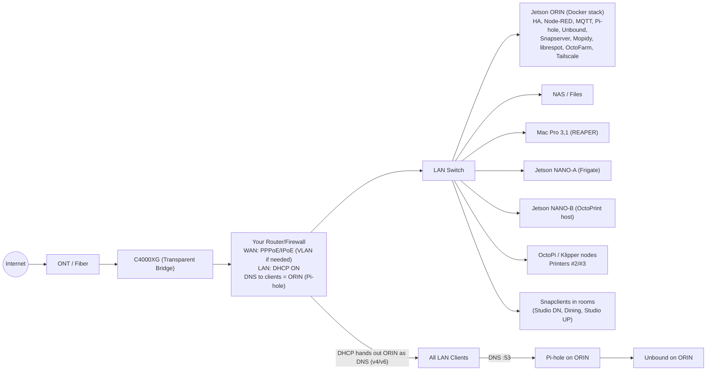
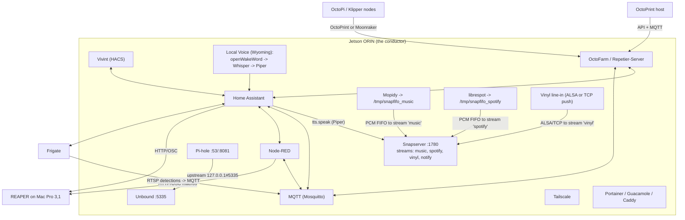
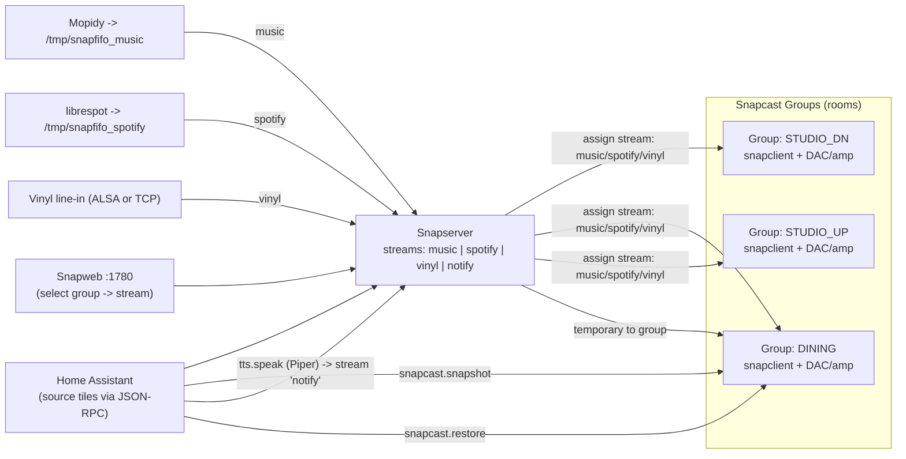

# Jetson-Orchestrated Home & Studio — Option C System Map

*A living map of the network, audio fabric, automations, and edges.*  

---

## Start here

New to the stack? Grab the short, reliable contracts first, then dive into the long-form map.

- [`atlas/interop.yaml`](./atlas/interop.yaml) — interop surfaces, stable IDs, and invariants.
- [`docs/FIELD_CARD.md`](./docs/FIELD_CARD.md) — fast field guide: bring-up, ports, and fixes.
- [`docs/assistant/README.md`](./docs/assistant/README.md) — the always-on local assistant (LLM + RAG) that stays on the Orin.

---

## Quick legend

- **ORIN** = Jetson Orin Nano (“the conductor”) near router/NAS.  
- **NANO‑A** = Frigate/vision edge.  
- **NANO‑B** = Print edge (OctoPrint host for at least one printer).  
- **Rooms** = Snapcast clients (Studio downstairs, Dining, Studio upstairs).  
- **Your Router/Firewall** = your own downstream router; C4000XG is in Transparent Bridge.

You’ll customize IPs, names, and ports below.

---

## Variables (fill these once)

| Name | Example | Meaning |
|---|---|---|
| `ORIN_HOSTNAME` | `orin-core` | Linux hostname for the Orin |
| `ORIN_IP` | `192.168.50.50` | Static LAN IP for Orin |
| `ROUTER_LAN` | `192.168.50.0/24` | LAN subnet |
| `ROUTER_DNS_V4` | `192.168.50.50` | DNS handed to clients (Pi-hole on Orin) |
| `ROUTER_DNS_V6` | `fd00::50` | v6 DNS (optional) |
| `MOPIDY_FIFO` | `/tmp/snapfifo_music` | FIFO for Mopidy → Snapcast |
| `LIBRESPOT_FIFO` | `/tmp/snapfifo_spotify` | FIFO for librespot → Snapcast |
| `VINYL_ALSA_DEV` | `hw:1,0` | ALSA device for USB ADC |
| `SNAPWEB_PORT` | `1780` | Snapserver web UI port |
| `HA_URL` | `http://homeassistant.local:8123` | Home Assistant URL |

---

## Compose stack: straight from the map

Tired of translating diagrams into YAML by hand? Same. The new [`docker-compose.yml`](./docker-compose.yml) is a faithful mirror of the Option C map—no mystery containers, no "lol just install later". Drop it on the Orin (or Portainer stack it) and you get the whole conductor bundle in one punch.

### 0. Prime a `.env`

Start by copying the new [`.env.example`](./.env.example) into place and then riffing on it:

```bash
cp .env.example .env
```

> **Why `.env`?** Compose slurps it automatically, and it keeps the YAML clean enough to read while you’re SSH’d in at 2 a.m.

Use the **Variables** table above as your field guide while you edit—no need to duplicate the contents here. The `.env.example` file already mirrors those keys; keep it close and adjust values for your LAN.

### 1. Scaffold volumes once

Most services persist to `./data` or `./config`. Instead of the mega-`mkdir`, let the repo do the grunt work:

```bash
./scripts/bootstrap-volumes.sh
```

The script is idempotent and safe to rerun; it creates every bind-mounted directory, peeks at `.env` for `MOPIDY_FIFO` and `LIBRESPOT_FIFO`, and drops in Snapcast-ready named pipes (or defaults to `./data/snapcast/fifo/snapfifo_*`).
If you point those FIFO vars at `/tmp` or some other haunt, the script will happily chase them down and make the pipes there too.

It also seeds **Unbound**’s starter config under [`config/unbound/`](./config/unbound). The main file is [`unbound.conf`](./config/unbound/unbound.conf) and the fragments in [`conf.d/`](./config/unbound/conf.d) carry the access-control and optional forward-zone stubs. Hack on those when you want to change who can query the resolver or where it forwards instead of root walking.

### Mopidy config primer

The bootstrap script also carves out [`config/mopidy/`](./config/mopidy/) so the Mopidy container isn’t running blind. Drop a `mopidy.conf` in there before you `up` the stack—here’s a minimal-but-useful starting point that pipes audio into the Snapcast FIFO and exposes both local files and Spotify:

```ini
[core]
cache_dir = /var/lib/mopidy/.cache
data_dir = /var/lib/mopidy/.local/share/mopidy

[audio]
output = audioresample ! audioconvert ! audio/x-raw,rate=48000,channels=2,format=S16LE ! queue ! filesink location=${MOPIDY_FIFO}

[file]
media_dirs = /media/music

[local]
enabled = true
media_dir = /media/music

[spotify]
enabled = true
username = ${SPOTIFY_USERNAME}
password = ${SPOTIFY_PASSWORD}
client_id = ${SPOTIFY_CLIENT_ID}
client_secret = ${SPOTIFY_CLIENT_SECRET}

[iris]
enabled = true
country = US
```

Mount your actual library into `data/mopidy` (or adjust `media_dirs`), feed Spotify credentials via the Mopidy container environment/secrets if you use that backend, and swap the output line if you prefer ALSA direct. The point: keep Mopidy’s config in git-friendly plain text so future-you understands why the audio graph works.

### 2. Light the stack

```bash
docker compose pull
docker compose up -d
```

> **Heads-up:** the audio pieces (Snapserver, Mopidy, librespot, vinyl ingest) all run in host network mode so ALSA/FIFO traffic works. If you change ports, update the Mermaid diagrams too—future you will thank present you.

### 3. Post-boot checklist

- `http://$ORIN_IP:8123` → Home Assistant onboarding.
- `http://$ORIN_IP:1880` → Node-RED flows (drop in your OSC/HTTP bridges).
- `http://$ORIN_IP:4000` → OctoFarm, point it at NANO-B and OctoPi nodes.
- `http://$ORIN_IP/admin` → Pi-hole (DNS upstream already chained to Unbound).
- `tailscale status` inside the container once you `docker exec -it tailscale tailscale up`.
- Snapweb on `http://$ORIN_IP:1780` for group/stream wiring.

Once the stack is up, the rest of this README still functions as your north star—automations, audio routing, Vivint glue, all unchanged.

---

## Local assistant (LLM + RAG on the Orin)

Want a codex‑ish assistant that never leaves your LAN? The stack now includes an **optional assistant profile**: Qdrant + llama.cpp + a tiny API service + a one‑shot ingest job. All local, all yours.

Start it like this:

```bash
docker compose --profile assistant up -d qdrant llama-server assistant-api
docker compose --profile assistant run --rm assistant-ingest
```

Then ask questions straight from the terminal:

```bash
./scripts/ask "How is the Snapcast audio graph wired?"
```

Field notes live here: [`docs/assistant/README.md`](./docs/assistant/README.md).

---

## 1) Network backbone (Option C)



---

## 2) ORIN core services & control paths



---

## 3) Multi-room audio (per-room sources + scoped TTS)



### Hardware cheat-sheet (keep it loud, keep it clean)

| Room vibe | Snapclient class | DAC → Amp pairing | Notes |
|---|---|---|---|
| Studio downstairs | Pi 4 + PoE hat | Hifiberry DAC2 Pro → Fosi V3 | Balanced-ish, add a fan if you’re running tubes nearby. |
| Dining | Thin client (HP T630) | SMSL Sanskrit 10th MKII → Audioengine N22 | USB-powered DAC keeps wiring short; stick felt pads on the amp so it doesn’t skateboard off the buffet. |
| Studio upstairs | Jetson Nano | Topping D10s → Crown XLS 1002 | D10s exposes bit-perfect USB, Crown does the muscle; feed balanced TRS from the Crown to nearfields. |

**Wiring mantra:** keep USB cables ≤1 m, run balanced wherever the amp allows, and ground-loop isolators are cheaper than hunting a mystery hum at 2 AM.

### ALSA device discovery riffs

- `aplay -l` → list playback hardware cards (your DACs). Run it on each snapclient host after plugging the DAC. Note the `card,device` tuple for Snapcast configs.
- `arecord -l` → same idea for capture devices; that’s how you find the vinyl ADC before you point `ffmpeg` at `hw:1,0` or similar.
- `cat /proc/asound/cards` → quick sanity check that the kernel even sees your gear.
- `ffmpeg -f alsa -list_devices true -i dummy` → verbose dump of ALSA names; clutch when the `hw:` shortcut fails.
- `alsactl store` after you dial in mixer gains so reboot gremlins don’t nuke your levels.

### FIFO / TCP latency troubleshooting (vinyl line-in edition)

1. **Measure first.** From any Snapclient box run `snapclient --latency` and note the ms. You’re hunting drift, not feelings.
2. **FIFO back-pressure:**
   - If vinyl audio arrives late, peek at `sudo lsof /tmp/snapfifo_vinyl` (or whatever you named it). If writers outnumber readers, you’re stalled.
   - Bump Snapserver’s `buffer` per stream (e.g., `"buffer": 2000` in `snapserver.conf`) then re-test. Too high and group sync lags.
3. **TCP push tuning (riff on that `ffmpeg` command from §4):**
   - Add `-fflags +nobuffer -flags low_delay -flush_packets 1` to the vinyl sender:
     ```bash
     ffmpeg -re -fflags +nobuffer -flags low_delay -flush_packets 1 \
       -f alsa -ac 2 -ar 48000 -i hw:1,0 \
       -f s16le tcp://ORIN_IP:1704
     ```
   - Still laggy? Drop `-re` so ffmpeg shoves frames as fast as they appear, and watch CPU.
   - If packets choke, slide over to RTP: `-f rtp rtp://ORIN_IP:5004` and point Snapserver’s stream at that port (latency drops, but you’ll need firewall love).
4. **Clock slips:** USB ADCs love to wander. Pin them to a powered hub, or graduate to an interface that exposes Word Clock / SPDIF and slave everything.
5. **Room-specific offsets:** Last mile fix—use `snapclient --setlatency <ms>` per host to nudge the straggler forward or back.

---

## 4) Minimal bring-up checklist

1. **Bridge the C4000XG**, set your **router** WAN (PPPoE/IPoE, VLAN if needed), enable DHCP.  
2. Reserve `ORIN_IP` on the router, and **hand out ORIN as DNS (v4/v6)**.  
3. On ORIN: deploy Docker stack (HA, Node-RED, Mosquitto, Pi-hole, Unbound, Snapserver, Mopidy, librespot, OctoFarm).  
4. On room boxes: install **snapclient** and join the Snapserver. Create three **groups** in Snapweb.  
5. In HA: add **Snapcast**, **Vivint (HACS)**, **Google Calendar(s)**; create “source select” tiles and TTS automations.  
6. For vinyl: attach USB ADC at `VINYL_ALSA_DEV` on ORIN **or** push from a small box via:\
   `ffmpeg -f alsa -i hw:1,0 -ac 2 -ar 48000 -f s16le tcp://ORIN_IP:1704`.

---

## 5) Room source selectors (HA stub)

```yaml
# input_selects per room (show as tiles)
input_select:
  src_studio_dn:
    name: Studio Downstairs Source
    options: [music, spotify, vinyl]
  src_dining:
    name: Dining Source
    options: [music, spotify, vinyl]
  src_studio_up:
    name: Studio Upstairs Source
    options: [music, spotify, vinyl]

# rest_command calling Snapcast JSON-RPC (adjust ORIN_IP)
rest_command:
  snap_set_stream:
    url: "http://{{ ORIN_IP }}:1780/jsonrpc"
    method: post
    headers:
      Content-Type: application/json
    payload: >
      {"id":1,"jsonrpc":"2.0","method":"Group.SetStream","params":{"id":"{{ group_id }}","stream_id":"{{ stream_id }}"}}

# automations mapping selects -> group streams
automation:
  - alias: "Studio DN source select"
    trigger: { platform: state, entity_id: input_select.src_studio_dn }
    action:
      - service: rest_command.snap_set_stream
        data:
          group_id: "G_STUDIO_DN"     # use your real group id from Snapweb JSON
          stream_id: "{{ states('input_select.src_studio_dn') }}"
```

---

## 6) Security hardening moves (keep DNS + remote access tight)

Lay these in right after basic bring-up so you never have to wonder who can whistle into your stack.

### Firewall choreography

| Rule | Interface | Action | Why |
|---|---|---|---|
| Allow `LAN -> ORIN` TCP/UDP `53`, TCP `5335`, TCP `1780`, TCP `8123`, TCP `9001-9003` (Snap/MQTT/HA) | LAN | Accept | LAN clients need DNS + control-path ports |
| Allow `TAILNET -> ORIN` TCP `22`, TCP `8123`, TCP `9001-9003`, TCP `8081`, TCP `1780` | Tailscale interface | Accept | Tailnet-only remote admin + HA |
| Block `WAN -> ORIN` any | WAN | Drop | No exposed services to the raw internet |
| Block `LAN -> ORIN` TCP `22` except management IPs | LAN | Drop | Only your jump boxes SSH in |
| Block `LAN/WAN -> ORIN` TCP/UDP `53` unless source = LAN/Tailnet CIDR | LAN/WAN | Drop | Keeps Pi-hole DNS scoped |

*(Translate to your firewall syntax: e.g., `set firewall name LAN-IN rule 10 action accept ...` on VyOS, or `ufw allow from 192.168.50.0/24 to any port 53 proto tcp` on Ubuntu.)*

### Tailscale container onboarding

Once the container is up, hop in and light it up:

```bash
docker exec -it tailscale \
  tailscale up \
  --authkey ${TAILSCALE_AUTHKEY} \
  --hostname ${ORIN_HOSTNAME}-tailscale \
  --advertise-tags=tag:admin,tag:automation \
  --accept-dns=false \
  --reset
```

- **Auth keys:** use ephemeral keys when you can (`tskey-ephemeral-...`) so the node evaporates if the container rebuilds before you notice.
- **Hostname tags:** the compose file already binds `/var/lib/tailscale`, so re-using a hostname keeps the node identity stable; the `--advertise-tags` line matches the ACL example below.
- **Exit nodes:** skip `--exit-node` unless you’re intentionally hairpinning. This stack wants local LAN latency, not tailnet detours.
- **DNS:** we hand out Pi-hole via tailnet DNS already, so `--accept-dns=false` keeps the container from overriding its own resolver.

### Tailscale ACL snippet

The repo now ships [`tailscale-acl.example.json`](./tailscale-acl.example.json). Drop it into the Tailscale admin console’s ACL editor, swap hostnames/IPs for your world, and commit. It captures the same intent as before—admin boxes can SSH/HA/Snapweb, display panels only get HA, automation boxes get MQTT.

- Tag every box that should reach Orin (`tailscale tag set admin orin-core`).
- Use tailnet DNS → Pi-hole so remote devices resolve your LAN hostnames without leaking queries.
- Reject everything else by default; only ship the ports you actually monitor.

### Pi-hole + Unbound best practices

- Bind Pi-hole to **LAN + Tailscale** interfaces only (`Settings → DNS → Interface listening behavior → Listen on all interfaces, permit only listed clients`).
- Lock Unbound to localhost (`interface: 127.0.0.1` and optionally the Tailscale IP if you run split DNS).
- Enable **DNSSEC** and **QNAME minimisation** inside `unbound.conf` to shred metadata.
- Default config lives at `config/unbound/unbound.conf`; ACL and forwarder overrides sit in `config/unbound/conf.d/*.conf`. Copy/paste the examples, then keep Pi-hole’s upstream pinned to `127.0.0.1#5335`.
- Populate Pi-hole’s **Conditional Forwarding** with your router’s subnet only if you absolutely need reverse lookups; otherwise, keep queries local.
- Create an allow-list of client subnets (LAN + tailnet) and drop everything else (`pihole -a -iL "192.168.50.0/24,100.64.0.0/10"`).
- Monitor Pi-hole audit logs and port hits via your firewall—unexpected chatter means something’s phoning home.

## 7) Notes

- Keep **Pi-hole** bound to LAN/tailnet only; upstream is **Unbound** at `127.0.0.1#5335`.
- Use **Tailscale** for private remote access to HA, OctoFarm, Snapweb, Pi-hole; set tailnet DNS → ORIN.
- For REAPER, enable **Web Remote** + **OSC** on the Mac; Node-RED/HA call your custom actions.
- Vivint via **HACS** provides entities and RTSP modes; scope TTS to rooms with **snapcast.snapshot/restore**.
- Start simple: get one stream + one room working, then add the rest.

## When things crackle (troubleshooting crib sheet)

- **Snapcast FIFOs yelling about permissions:** the bootstrap script leaves FIFOs as world-writable `mkfifo` artifacts. If Docker remaps them on you, nuke and re-run `./scripts/bootstrap-volumes.sh`, or `sudo chown root:audio /path/to/fifo && chmod 660` so host-mode containers can write.
- **ALSA device bingo:** list cards with `arecord -l` on the host (or inside the Mopidy/librespot containers with `docker exec -it mopidy arecord -l`). Match the `hw:X,Y` value with `VINYL_ALSA_DEV` and double-check the container has `--device /dev/snd` exposed.
- **Audio still stutters?** Tail the logs from the sound stack: `docker logs -f snapserver`, `docker logs -f mopidy`, and `docker logs -f librespot`. Crackling often means sample-rate mismatch—confirm Mopidy/librespot are hitting the Snapcast FIFOs at the same rate set in Snapserver.
- **Tailscale weirdness:** `docker exec -it tailscale tailscale status --peers` shows whether the node is actually on the tailnet. If it’s missing routes, rerun the `tailscale up` command with `--force-reauth`.

---

## 7) MQTT feedback loop recipes (copy-paste, then riff)

These are real-ish Node-RED exports and HA fragments that stitch the MQTT exhaust into loud, blinking, useful feedback. Drop them in, change the IDs, and you’ve got closed loops instead of vibes.

### 7.1) Alert router — turn detections into scoped sirens

**What it does:** Frigate (or any camera box) screams on `frigate/events`. Node-RED filters for human-sized chaos, pings MQTT to flip a warning light, and asks HA to park a TTS call in just the downstairs studio Snapcast group.

**Node-RED flow export:** Grab the full patch-ready export at [`flows/alert-router.json`](./flows/alert-router.json)—same orchestra of MQTT inputs, switch gates, and HA service call without 3 pages of JSON glare.

**HA automation stub:**

```yaml
automation:
  - alias: "Studio DN warning light auto-off"
    trigger:
      - platform: state
        entity_id: light.studio_warning
        to: "on"
        for: "00:00:45"
    action:
      - service: mqtt.publish
        data:
          topic: studio_dn/warning_light/set
          payload: "off"
```

Result: camera → MQTT → Node-RED → MQTT/HA → Snapcast. Your bandmate hears the alert and the beacon chills itself after 45 seconds.

### 7.2) Printer truth table — OctoFarm → dashboard + siren

**What it does:** OctoFarm (or OctoPrint) is already spitting MQTT status on `octoprint/+/state`. Node-RED condenses it into a tidy dashboard panel, throws a print-finish confetti topic, and HA flips a status tile plus a “jobs done” light show.

**Node-RED flow export:** The exact table-building, confetti-publishing flow now lives in [`flows/printer-truth-table.json`](./flows/printer-truth-table.json). Import it straight into Node-RED and get on with printing.

**HA automation stub:**

```yaml
automation:
  - alias: "Printer finish glow-up"
    trigger:
      - platform: mqtt
        topic: studio/printers/finished
    action:
      - service: light.turn_on
        target:
          entity_id: light.studio_up_lifx_strip
        data:
          effect: morph
          color_name: cyan
          brightness_pct: 70
      - delay: "00:00:30"
      - service: light.turn_off
        target:
          entity_id: light.studio_up_lifx_strip
```

Now when a printer hits “Operational” post-job, MQTT kicks, Node-RED updates the on-wall dashboard, and HA paints the upstairs strip like you meant it.

### 7.3) REAPER cue launcher — timeline sync without yelling

**What it does:** HA exposes a helper button (or automation) that publishes cues to `studio/reaper/cue`. Node-RED listens, shapes it into either HTTP to Web Remote or straight OSC, and sends REAPER to the next marker while spitting an acknowledgement back on MQTT for dashboards.

**Node-RED flow export:** Import [`flows/reaper-cue-launcher.json`](./flows/reaper-cue-launcher.json) when you’re ready to smack REAPER via MQTT + OSC without scrolling through a JSON novella.

**HA helper + automation stub:**

```yaml
input_button:
  launch_reaper_cue:
    name: Launch next cue

automation:
  - alias: "Launch REAPER next cue"
    trigger:
      - platform: state
        entity_id: input_button.launch_reaper_cue
    action:
      - service: mqtt.publish
        data:
          topic: studio/reaper/cue
          payload: '{"action": "next"}'
```

Bonus move: drop the `studio/reaper/ack` topic into a Lovelace Markdown card so you can see who punched the cue last.
