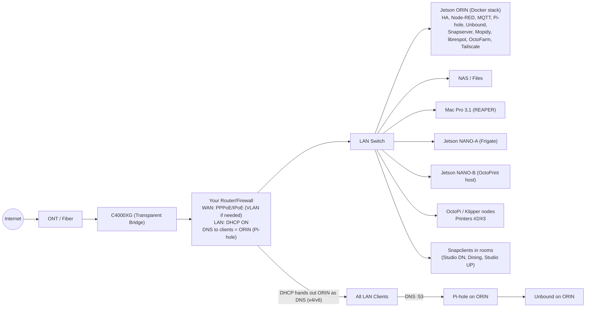
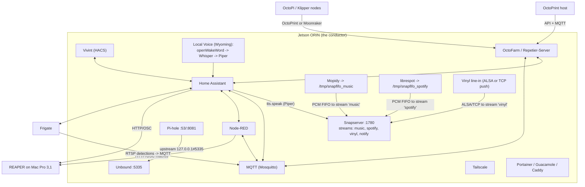
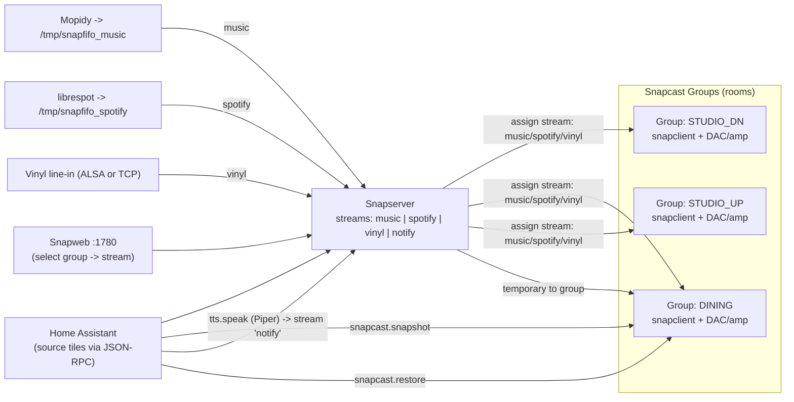

# Jetson-Orchestrated Home & Studio — Option C System Map

*A living map of the network, audio fabric, automations, and edges.*  
**Paste this whole file into your repo/wiki/Obsidian.** Mermaid diagrams are in fenced code blocks like ` ```mermaid `.

> **Tip:** If your viewer doesn’t render Mermaid, install a Mermaid plugin (e.g., VS Code “Markdown Preview Mermaid Support”) or use https://mermaid.live to preview each block.

---

## Quick legend

- **ORIN** = Jetson Orin Nano (“the conductor”) near router/NAS.  
- **NANO‑A** = Frigate/vision edge.  
- **NANO‑B** = Print edge (OctoPrint host for at least one printer).  
- **Rooms** = Snapcast clients (Studio downstairs, Dining, Studio upstairs).  
- **Your Router/Firewall** = your own downstream router; C4000XG is in Transparent Bridge.

You’ll customize IPs, names, and ports below.

---

## Variables (fill these once)

| Name | Example | Meaning |
|---|---|---|
| `ORIN_HOSTNAME` | `orin-core` | Linux hostname for the Orin |
| `ORIN_IP` | `192.168.50.50` | Static LAN IP for Orin |
| `ROUTER_LAN` | `192.168.50.0/24` | LAN subnet |
| `ROUTER_DNS_V4` | `192.168.50.50` | DNS handed to clients (Pi-hole on Orin) |
| `ROUTER_DNS_V6` | `fd00::50` | v6 DNS (optional) |
| `MOPIDY_FIFO` | `/tmp/snapfifo_music` | FIFO for Mopidy → Snapcast |
| `LIBRESPOT_FIFO` | `/tmp/snapfifo_spotify` | FIFO for librespot → Snapcast |
| `VINYL_ALSA_DEV` | `hw:1,0` | ALSA device for USB ADC |
| `SNAPWEB_PORT` | `1780` | Snapserver web UI port |
| `HA_URL` | `http://homeassistant.local:8123` | Home Assistant URL |

---

## Compose stack: straight from the map

Tired of translating diagrams into YAML by hand? Same. The new [`docker-compose.yml`](./docker-compose.yml) is a faithful mirror of the Option C map—no mystery containers, no "lol just install later". Drop it on the Orin (or Portainer stack it) and you get the whole conductor bundle in one punch.

### 0. Prime a `.env`

Copy the variable table above into a `.env` next to the compose file. Here’s a starter that matches the map notation:

```dotenv
TZ=America/Los_Angeles
ORIN_HOSTNAME=orin-core
ORIN_IP=192.168.50.50
ROUTER_LAN_GATEWAY=192.168.50.1
ROUTER_DNS_V4=192.168.50.50
ROUTER_DNS_V6=fd00::50
MOPIDY_FIFO=/tmp/snapfifo_music
LIBRESPOT_FIFO=/tmp/snapfifo_spotify
VINYL_ALSA_DEV=hw:1,0
TAILSCALE_AUTHKEY=tskey-please-set
PIHOLE_PASSWORD=change-me
ENABLE_IPV6=true
```

> **Why `.env`?** Compose slurps it automatically, and it keeps the YAML clean enough to read while you’re SSH’d in at 2 a.m.

### 1. Scaffold volumes once

Most services persist to `./data` or `./config`. Run this once so Docker doesn’t invent root-owned folders wherever:

```bash
mkdir -p data/{homeassistant,nodered,mosquitto/config,mosquitto/data,mosquitto/log,\
  pihole/etc-pihole,pihole/etc-dnsmasq.d,unbound,snapcast/{config,fifo},mopidy,\
  librespot/cache,octofarm,tailscale,portainer} config/mopidy
```

Snapserver expects FIFOs in `data/snapcast/fifo`. Create them after the first boot, or pre-create named pipes if you’re fancy.

### 2. Light the stack

```bash
docker compose pull
docker compose up -d
```

> **Heads-up:** the audio pieces (Snapserver, Mopidy, librespot, vinyl ingest) all run in host network mode so ALSA/FIFO traffic works. If you change ports, update the Mermaid diagrams too—future you will thank present you.

### 3. Post-boot checklist

- `http://$ORIN_IP:8123` → Home Assistant onboarding.
- `http://$ORIN_IP:1880` → Node-RED flows (drop in your OSC/HTTP bridges).
- `http://$ORIN_IP:4000` → OctoFarm, point it at NANO-B and OctoPi nodes.
- `http://$ORIN_IP/admin` → Pi-hole (DNS upstream already chained to Unbound).
- `tailscale status` inside the container once you `docker exec -it tailscale tailscale up`.
- Snapweb on `http://$ORIN_IP:1780` for group/stream wiring.

Once the stack is up, the rest of this README still functions as your north star—automations, audio routing, Vivint glue, all unchanged.

---

## 1) Network backbone (Option C)



---

## 2) ORIN core services & control paths



---

## 3) Multi-room audio (per-room sources + scoped TTS)



---

## 4) Minimal bring-up checklist

1. **Bridge the C4000XG**, set your **router** WAN (PPPoE/IPoE, VLAN if needed), enable DHCP.  
2. Reserve `ORIN_IP` on the router, and **hand out ORIN as DNS (v4/v6)**.  
3. On ORIN: deploy Docker stack (HA, Node-RED, Mosquitto, Pi-hole, Unbound, Snapserver, Mopidy, librespot, OctoFarm).  
4. On room boxes: install **snapclient** and join the Snapserver. Create three **groups** in Snapweb.  
5. In HA: add **Snapcast**, **Vivint (HACS)**, **Google Calendar(s)**; create “source select” tiles and TTS automations.  
6. For vinyl: attach USB ADC at `VINYL_ALSA_DEV` on ORIN **or** push from a small box via:\
   `ffmpeg -f alsa -i hw:1,0 -ac 2 -ar 48000 -f s16le tcp://ORIN_IP:1704`.

---

## 5) Room source selectors (HA stub)

```yaml
# input_selects per room (show as tiles)
input_select:
  src_studio_dn:
    name: Studio Downstairs Source
    options: [music, spotify, vinyl]
  src_dining:
    name: Dining Source
    options: [music, spotify, vinyl]
  src_studio_up:
    name: Studio Upstairs Source
    options: [music, spotify, vinyl]

# rest_command calling Snapcast JSON-RPC (adjust ORIN_IP)
rest_command:
  snap_set_stream:
    url: "http://{{ ORIN_IP }}:1780/jsonrpc"
    method: post
    headers:
      Content-Type: application/json
    payload: >
      {"id":1,"jsonrpc":"2.0","method":"Group.SetStream","params":{"id":"{{ group_id }}","stream_id":"{{ stream_id }}"}}

# automations mapping selects -> group streams
automation:
  - alias: "Studio DN source select"
    trigger: { platform: state, entity_id: input_select.src_studio_dn }
    action:
      - service: rest_command.snap_set_stream
        data:
          group_id: "G_STUDIO_DN"     # use your real group id from Snapweb JSON
          stream_id: "{{ states('input_select.src_studio_dn') }}"
```

---

## 6) Notes

- Keep **Pi-hole** bound to LAN/tailnet only; upstream is **Unbound** at `127.0.0.1#5335`.  
- Use **Tailscale** for private remote access to HA, OctoFarm, Snapweb, Pi-hole; set tailnet DNS → ORIN.  
- For REAPER, enable **Web Remote** + **OSC** on the Mac; Node-RED/HA call your custom actions.  
- Vivint via **HACS** provides entities and RTSP modes; scope TTS to rooms with **snapcast.snapshot/restore**.  
- Start simple: get one stream + one room working, then add the rest.

---

_Last updated: 2025‑09‑04_
