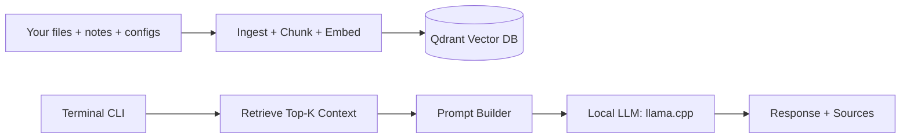

# Local Assistant on the Orin (LLM + RAG, fully in‑house)

This is the **always‑on, local‑only code + project assistant** living on the Jetson Orin. It’s a codex‑ish copilot that never leaves the building — no cloud calls unless you explicitly opt in. Think: *studio notebook meets teaching guide*, wired to your own data stack.

If you want a TL;DR: **this is a small, opinionated stack** built for Jetson realities. It favors utility, explainability, and the ability to fix it at 2 a.m. without a black‑box headache.

---

## What this stack does (intent, not hype)

- **Indexes your private data** (docs, configs, code, notes, logs).
- **Stores semantic vectors locally** (Qdrant on the Orin).
- **Answers questions in a terminal** using a local LLM.
- **Explains its sources** so you can trace the output back to your files.

This is retrieval‑augmented generation (RAG) with a very simple life philosophy: *If you can’t explain it, you can’t trust it.*

---

## Architecture: the short, honest version



**Key idea:** your data stays local. We only send **embeddings + prompts** to local services.

---

## Services in the assistant stack

- **`qdrant`** — local vector database for embeddings.
- **`assistant-api`** — FastAPI service: retrieves context and calls the local LLM.
- **`llama-server`** — llama.cpp server hosting a GGUF model.
- **`assistant-ingest`** — one‑shot indexer to scan your data, embed it, and push to Qdrant.

---

## Quick start (minimal, no‑drama path)

1. **Drop a model into place**
   - Put your GGUF model in `./data/assistant/models/`.
   - Example model filename: `llama3-8b-q4_k_m.gguf`.

2. **Edit `.env`** (or copy `.env.example` and tweak)
   - `ASSISTANT_MODEL_PATH=/models/llama3-8b-q4_k_m.gguf`
   - `ASSISTANT_COLLECTION=homeauto-assistant`
   - `ASSISTANT_DATA_ROOTS=./docs,./config,./scripts,./flows`

3. **Start the assistant stack**
   ```bash
   docker compose --profile assistant up -d qdrant llama-server assistant-api
   ```

4. **Index your data**
   ```bash
   docker compose --profile assistant run --rm assistant-ingest
   ```

5. **Ask questions in your terminal**
   ```bash
   ./scripts/ask "How does the Snapcast audio graph work?"
   ```

---

## Data ingestion rules (honest defaults)

The ingest service reads files from the configured roots (see `config/assistant/ingest.yaml`) and:

- Skips binaries and giant files.
- Chunks text into **overlapping blocks**.
- Stores **path + timestamps + chunk index** as metadata.

Why the overlap? So the assistant doesn’t lose a key line just because a chunk boundary cut it in half.

---

## How to think about models on Jetson

Jetson boards want **smaller, quantized GGUF** models. Examples that behave well:

- **Llama 3 8B** (Q4 or Q5)
- **Mistral 7B** (Q4)
- **Qwen 2.5 7B** (Q4/Q5)

The point: keep the model *fast enough* to be useful, or you’ll stop using it.

---

## Next steps / extensions

- Add **OCR** for PDFs or images (Tesseract or PaddleOCR).
- Add **audio transcript ingestion** (Whisper) for voice notes.
- Add **scheduled indexing** with a daily cron container.

But keep the core small. This is a machine you want to understand, not worship.

---

## If you want to go deeper

- Field card: [`docs/assistant/FIELD_CARD.md`](./FIELD_CARD.md)
- Ingest config: [`config/assistant/ingest.yaml`](../../config/assistant/ingest.yaml)
- CLI entrypoint: [`scripts/ask`](../../scripts/ask)

